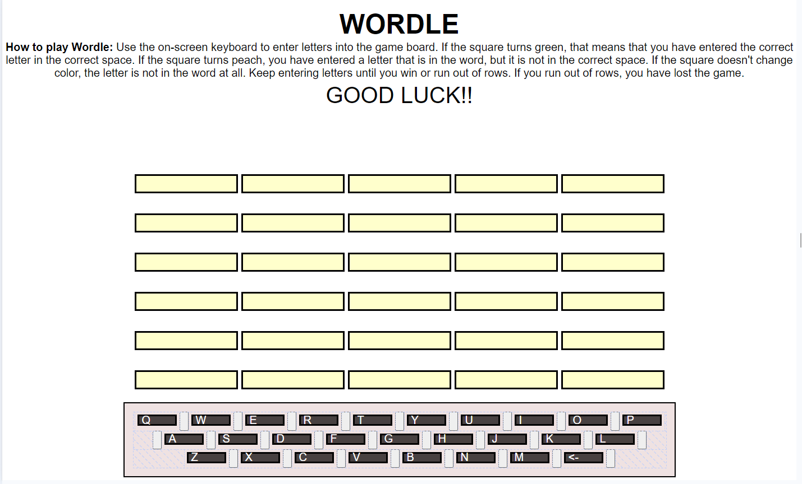

# WORDLE

## Description of Project

The project was to create a browser-based game utlizing the concepts we had learned so far in the course:  HTML, CSS (incuding Flexbox and/or Grid), JavaScript, DOM and Markdown.  Once completed, we were to present our game to the class.  This was the first project we completed in this course.

## Brief

Game must have been chosen from a list of recommended games.  For Wordle, we were required to have an on-screen keyboard and to display guessed letters on tiles with animation based on their status. The following minimum requirements were to be met:

* Render the game in the browser using the DOM manipulation techniques demonstrated in lecture.

* Include win/loss logic and render win/loss messages in HTML. The game you chose must have a win/lose condition.

* Include separate HTML, CSS, JavaScript, and JavaScript data files organized in an appropriate directory structure.

* Include all required features specific to your game based on the Recommended Games document.

* The game is deployed online so that the rest of the world can play it.


## Timeframe & Working Team

We worked solo on this project and were given a week to complete it.

## Getting Started/Code Installation

The code for this project can be found in my public GitHub repository  [here](https://github.com/chaoscgo/Wordle-Game---Unit-One-project.git).




# How to play Wordle

Wordle is a fun game that challenges you to guess a word that the computer has randomly generated.  Millions of people play this game through [New York Times](https://www.nytimes.com/games/wordle/index.html) and share their results on social media.  I chose this game because I play it every day and love it!

You will enter letters using the on-screen keyboard.  If the square turns green, you have the correct letter in the correct space.  If the square turns peach, you have a letter that is in the word, but not in the correct space.  If the square doesn't change color, the letter is not in the word.

You have six chances to enter words.  If you match the computer's word, you win the game!  If you enter six words and still haven't guessed the word, you lose.

## Deployment Link

To get started on the fun, click [here](https://chaoscgo.github.io/Wordle-Game---Unit-One-project/).

## Planning Materials

I started with a sketch of how I wanted the game to look as well as some logic I felt would be needed:


I then wrote out some Psuedo code to help me get organized:


Then I got to coding!  

## Build/Code Process

First, I created a constant array to handle the Computer Choices.  I limited this array to less than 100 entries in order not to slow down the game.

I defined all the variables that I would need in the game and created some cached element references to capture DOM elements needed in my game.

I added code to have the computer choose a word from the available array of words to be the solution.  I also split this word into letters so that I could compare player entries for each letter entered.

The init() function set all the variables (arrays, messages, words, letters and clicks) to either empty or null values.

I added event listeners to handle each click of the keys on the keyboard and the reset button.

For each key entered (clicked) in the keyboard, I created code to place the letter on the board and to compare it to the matching letter in the solution array. In order to keep track on the board, I had to also keep track of the clicks.

```const placeLetter = (content, clicks) => {
        
    if (clicks < 6) {
        inputBoardRow1.push(content);
        boardRowEls[clicks-1].textContent = content;
        joinLetters(inputBoardRow1, clicks);
    } else if (clicks > 5 && clicks < 11) {
            inputBoardRow2.push(content);
            boardRowEls[clicks-1].textContent = content;
            joinLetters(inputBoardRow2, clicks);
    } else if (clicks > 10 && clicks < 16) {
            inputBoardRow3.push(content);
            boardRowEls[clicks-1].textContent = content;
            joinLetters(inputBoardRow3, clicks);
    } else if (clicks > 15 && clicks < 21) {
            inputBoardRow4.push(content);
            boardRowEls[clicks-1].textContent = content;
            joinLetters(inputBoardRow4, clicks);
    } else if (clicks > 20 && clicks < 26) {
            inputBoardRow5.push(content);
            boardRowEls[clicks-1].textContent = content;
            joinLetters(inputBoardRow5, clicks);
    } else if (clicks > 25 && clicks < 31) {
            inputBoardRow6.push(content);
            boardRowEls[clicks-1].textContent = content;
            joinLetters(inputBoardRow6, clicks);
    }
}

const compareLetters = (keyContent, clicks) => {

    if (clicks > 0 && clicks < 6) {
        clicksAdj = clicks;
    } else if (clicks > 5 && clicks < 11) {
        clicksAdj = clicks-5;
    } else if (clicks > 10 && clicks < 16) {
        clicksAdj = clicks-10;
    } else if (clicks > 15 && clicks < 21) {
        clicksAdj = clicks-15;
    } else if (clicks > 20 && clicks < 26) {
        clicksAdj = clicks-20;
    } else if (clicks > 25 && clicks < 31) {
        clicksAdj = clicks-25;
    }

    if (keyContent === compLetters[clicksAdj-1]) {
        boardRowEls[clicks-1].classList.add('green');
    } else if (keyContent !== compLetters[clicksAdj-1] && compLetters.includes(keyContent)) {
        boardRowEls[clicks-1].classList.add('peach');
    }
}

```

After the Player entered five letters (clicks on the keyboard), I created code to join the letters together into a word string so that I could compare them to the computer's word solution and determine if the Player had won or needed to Try Again.  After the Player had entered the last word on the sixth row, I also checked to see if they had won or lost (no more chances).  

```
const joinLetters = (inputBoardRow1, clicks) => {
    
    if (clicks === 5) {
        const playerWord = inputBoardRow1.join('');
        compareSolution(solution, playerWord);
    } else if (clicks === 10) {
        const playerWord = inputBoardRow2.join('');
        compareSolution(solution, playerWord);
    } else if (clicks === 15) {
        const playerWord = inputBoardRow3.join('');
        compareSolution(solution, playerWord);
    } else if (clicks === 20) {
        const playerWord = inputBoardRow4.join('');
        compareSolution(solution, playerWord);
    } else if (clicks === 25) {
        const playerWord = inputBoardRow5.join('');
        compareSolution(solution, playerWord);
    } else if (clicks === 30) {
        const playerWord = inputBoardRow6.join('');
        compareSolution(solution, playerWord);
    }
}

const compareSolution = (solution, playerWord) => {
    
    if (solution === playerWord) {
        messageEl.textContent = 'You win!!';
        resetBtnEl.classList.remove('hidden');
    } else if (solution !== playerWord && clicks < 30) {
        messageEl.textContent = 'Try Again!';
    } else if (solution !== playerWord && clicks === 30) {
        messageEl.textContent = 'You lose!';
        resetBtnEl.classList.remove('hidden');
    }
}
```
The Player then had the opportunity to play again by clicking on the Play Again button that was hidden during normal play.

CSS:
```
.hidden {
    visibility: hidden;
}
```
JSS:
```
    if (solution === playerWord) {
        messageEl.textContent = 'You win!!';
        resetBtnEl.classList.remove('hidden');
    } else if (solution !== playerWord && clicks < 30) {
        messageEl.textContent = 'Try Again!';
    } else if (solution !== playerWord && clicks === 30) {
        messageEl.textContent = 'You lose!';
        resetBtnEl.classList.remove('hidden');
    }
```

## Challenges

I particularly found the layout of the web page to be challenging.  I need to get a firmer grasp on CSS grid to help with this. Instead, I played around with Flexbox and individual element styling to work it out.

I also had trouble getting my backspace key to work.  I believe it might be easier to implement if I use objects of nested arrays instead of individual arrays.

## Wins

I was very happy that I was able to get the Play Again reset button to remain hidden during the game and only appear when the game was over.

Even though there might be a better way to accomplish this, I was particularly proud that I was able to get the game to work based on the number of clicks on the keyboard.  That appealed to the math/logic side of my brain.

## Key Learnings/Takeaways

I learned from this project where some of my weaknesses lie.  I need to study up on CSS Flexbox and Grid as well as practice more with objects and nested arrays.  Also, determining the order of code in both the JavaScript and CSS files is something I would like to strengthen my skills in.

However, I do feel like I have a stronger grasp of coding logic after working through this project.  I look forward to learning even more!

## Bugs

* The backspace key is not working yet.  

* There is no word validation against a dictionary source.  Players can enter nonsense words if they choose to. 

* The array of words that the computer has access to is limited to less than 100 words and there is nothing in place so that it doesn't choose the same word twice in a row.

* If a Player enters a correct letter in the correct space, but then enters that letter again in another space, the square turns peach even if that letter does not appear again in the word.  I would like it to remain the original square color choice.

## Attributions
Computer word choice generated by [Chat GPI](https://www.chatgpt.com/).

## Technologies used: 

HTML, CSS, JavaScript and Markdown.

## Future plans/improvements

* Increased word choices for the computer
* Back-space key functionality
* Word validation from Merriam-Webster's dictionary API
* Ability to distinguish between duplicate letters in a word as being used only once in the solution.
* Letters struck from the keyboard once it's determined they are not in the solution

